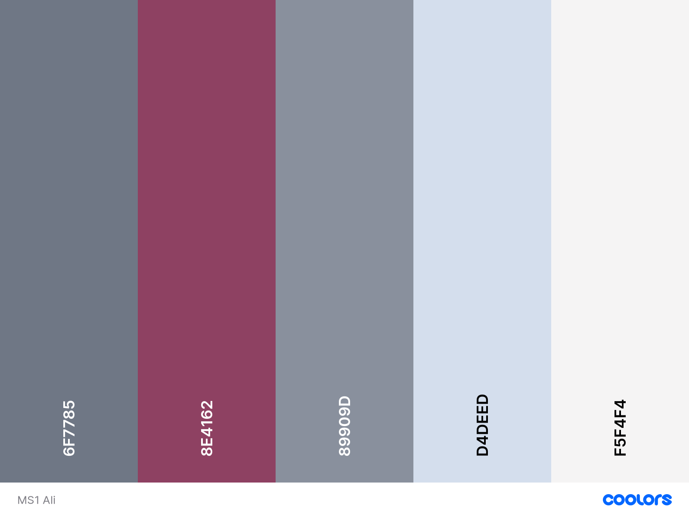

**Alison Melville's Shiatsu** needs a B2C website that showcases a massage business specialising in Shin Tai near Manchester. I designed the site to educate the user about the benefits of Shiatsu Shin Tai and allow them to contact her to book a consultation. 
I created the site to look professional and in keeping with the theme of similar Shiatsu websites and using the colour schemes to bring a relaxing impression as would be expected with a massage site.
The goal of the website will be to interact with existing and potential clients and be a source of information to educate them, build confidence and encourage them to contact the business owner.
The site must contain all information required to complete these goals.
Site visitors will most likely be comparing with other similar services in the local area so must stand out and show everything the user would want to see.

## **Contents**

- [**UX (User Experience)**](#ux-user-experience)
  - [**Project Goals**](#project-goals)
  - [**User Goals**](#user-goals)
  - [**User Stories**](#user-stories)
  - [**Site Owner Goals**](#site-owner-goals)
- [**Design Choices**](#design-choices)
  - [**Fonts**](#fonts)
  - [**Colours**](#colours)
  - [**Imagery**](#imagery)
  - [**Wireframes**](#wireframes)
- [**Technologies**](#technologies)
  - [**Languages**](#languages)
  - [**Libraries**](#libraries)
  - [**Tools**](#tools)
- [**Features**](#features)
  - [**Features Implemented**](#features-implemented)
  - [**Future Features**](#future-features)
  - [**Responsive Design**](#responsive-design)
  - [**Site Construction**](#site-construction)
  - [**Page Layout**](#page-layout)
    - [**INDEX.HTML**](#indexhtml)
    - [**CONTENT.HTML**](#contenthtml)
- [**Version Control**](#version-control)
- [**Testing**](#testing)
- [**Bugs**](#bugs)
- [**Deployment**](#deployment)
  - [**Running Locally**](#running-locally)
- [**Credits**](#credits)
  - [**Content**](#content)
  - [**Images**](#images)
  - [**Colour**](#colour)
  - [**Inspiration**](#inspiration)
  - [**Acknowledgements**](#acknowledgements)

# Ali's Shiatsu

This project is designed to showcase the Shiatsu Shin Tai massage with some information about its derivation, how Ali came to learn it and study it and an opportunity for the user to contact the business owner for more information and to book appointments. 

 
## **UX (User Experience)**
 
### **Project Goals**
- The primary goal of this site is to showcase Ali's Shiatsu Shin Tai massage business to attract new clients and provide a means of communication while linking to social media pages. 

### **User Goals**
- The user will be able to find out more about shiatsu shin tai and be able to contact Ali for more information.

### **User Stories**

- As a user I want to use the site to learn more about Shiatsu Shin Tai and how to contact the business owner so that I can have a massage.
- As a user I want to be able to communicate with the business owner and find out what is involved in a Shiatsu Shin Tai massage so that I can decide if I'd like to try it. 
- As a user I want to be able to see social media links so that I can keep up to date through Facebook, Instagram and Twitter.
- As a user I want to see a demonstration of what to expect when receiving a Shiatsu Shin Tai massage.
- As a user I want to click the navigation links to be taken to the correct section and also back to home for a better user experience.
- As a user I want the page to be in a predictable layout so that I can navigate it easily.  
- As a user I want pricing information to be on the site so that I can compare with other providers.
- As a user I want to see a map of the location so that I can determine how close it is to my location and navigate there easily.  

### **Site Owner Goals** 
- As a site owner I want the user to learn about Shiatsu Shin Tai massage and the business owner.
- As a site owner I want the user to be able to communicate with the business owner on social media and through contact form.
- As a site owner I want to show the user that the business owner is a registered practitioner of her work.
- As a site owner I want to create a website with a great user experience so that visitors will come again. 

[Back to contents](#contents)

## **Design Choices**

### **Fonts**

I have chosen [Open Sans](https://fonts.google.com/specimen/Open+Sans?query=open+sans) for the headers and [Roboto](https://fonts.google.com/specimen/Roboto) for the rest of the text on the site (eg. paragraphs and lists)

### **Colours**

Format: 
and rgba(245, 244, 244, 0.8) for the Jumbotron.

These colours compliment each other well and are not too striking, in keeping with what the user expects of a massage site. 

### **Imagery**
 
Images can be found in [assets](assets/images) and have been sourced from Unsplash and Pexels sites which are free to use if credited. 

- index.html
  - The [Hero image](assets/images/conscious-design-J16LdoIsRJM-unsplash.jpg) on index.html was sourced from [Unsplash](https://unsplash.com/). Photo by <a href="https://unsplash.com/@conscious_design?utm_source=unsplash&utm_medium=referral&utm_content=creditCopyText">Conscious Design</a> on <a href="https://unsplash.com/s/photos/massage-therapy?utm_source=unsplash&utm_medium=referral&utm_content=creditCopyText">Unsplash</a>
  - The images of [Alison Performing Shin Tai Massage](assets/images/Ali-massage2.jpg) and [Alison's profile photo](assets/images/ali-photo2.jpg)  were taken by her husband, Iain Melville.

- contact.html
The hero image on contact.html was sourced from [Unsplash](https://unsplash.com/). Photo by <a href="https://unsplash.com/@lgence?utm_source=unsplash&utm_medium=referral&utm_content=creditCopyText">Laurent Gence</a> on <a href="https://unsplash.com/@dfu05229/likes?utm_source=unsplash&utm_medium=referral&utm_content=creditCopyText">Unsplash</a>
  
### Video

-index.html
  - The [Massage Demonstration Video](https://youtu.be/aLYgPbQXyGw) is performed by Saul Goodman and credit given on site. 

### **Wireframes**

The wireframes were created using [Balsamiq](https://balsamiq.com/) and can be found in pdf form in [wireframes](wireframes)

- [Home](wireframes/index.html)
- [Contact Page](wireframes/contact.html)
- [Mobile View - Home](wireframes/mobile-index.html)
- [Mobile View - Contact Page](wireframes/mobile-contact.html)
- [Tablet View - Home](wireframes/tablet-index.html)
- [Tablet View - Contact Page](wireframes/tablet-contact.html)

[Back to contents](#contents)

## **Technologies**

### **Languages**

- [HTML5](https://developer.mozilla.org/en-US/docs/Web/HTML)
  - Used as the main markup language for the website content.
- [CSS3](https://developer.mozilla.org/en-US/docs/Web/CSS)
  - Used to style the individual webpages.
- [jQuery](https://developer.mozilla.org/en-US/docs/Glossary/jQuery) and [Popper.js](https://popper.js.org/)
  - Used with Bootstrap Scrollspy to track location on the page and Bootstrap Collapse for Accordian sections on mobile and tablet view. 

### **Libraries**
​
- [Bootstrap](https://getbootstrap.com/)
  - Used to design a mobile-first responsive website layout.

  
### **Tools**

- [Git](https://git-scm.com/)
  - Git was used for version control (commit to Git and push to GitHub).
- [GitHub](https://github.com/)
  - Used to store, host and deploy the project files and source code after being pushed from Git. I also used it for the Project Kanban board.
- [Gitpod](https://www.gitpod.io/)
  - An online IDE linked to the GitHub repository used to write my code.
- [Font-Awesome](https://fontawesome.com/icons?d=gallery)
  - Used to make headings stand out and for favicon.
- [Google fonts](https://fonts.google.com/)
  - Used to compare and choose fonts. 
- [Coolors](https://coolors.co/)
  - Used to research and choose the colour scheme by comparing and contrasting similar colours in the generator.
- [Favicons](https://favicon.io/)
  - Used to generate a favicon for the website title.
- [Lighthouse](https://developers.google.com/web/tools/lighthouse)
  - Used to audit the site for quality.
- [What is my Screen Resolution](http://whatismyscreenresolution.net/)
  - An online tool to find out the screen resolution on your device used for CSS @media queries

[Back to contents](#contents)

## **Features**

In this section, you should go over the different parts of your project, and describe each in a sentence or so.
 
### **Features Implemented**

- Feature one is a section with a description of Shiatsu which educates users to the basics of Shiatsu massage.
- Feature two is a section about the specific Shin Tai massage which allows users to understand more about the subject, origin and health benefits.
- Feature three is a section about the business owner and masseuse, Ali, including qualifications and an image of her for users to relate to. 
- Feature four is a list of recent testimonials so that the user can identify how other users have benefitted from the service.
- Feature five is a section about what to expect during the service including a youtube video tutorial.
- Feature six is a Google Map location so that the users can find the area and compare to where they are located.
- Feature seven is a contact page where the user can communicate with the business owner by filling out a form.

### **Future Features**
- Later I would like to implement an appointment booking system and for the user to receive feedback of appointment booked via email and sms.
- I would also like to add an option for the user to add a testimonial to the business online.

### **Responsive Design**

### **Site Construction**

### **Page Layout**

[Back to contents](#contents)

## **Version Control**

**Version control** was managed within **GitHub** and **Gitpod** and regular commits pushed to **GitHub**.

### Gitpod Workspaces
1. Starting from GitHub clone the [Code Institute template](https://github.com/Code-Institute-Org/gitpod-full-template) by clicking Use This Template and copying to my repository under the name ms1-ali-shiatsu. The workspace is then launched by clicking GitPod - this action only needs to be performed once and then workspace reopened from GitPod.
2. Start the Gitpod Workspace which opens an **online IDE editor** window.

### Update GitHub by committing from GitPod
3. After each change made I would save the code, perform *git add .*, *git commit -m "commit message here"* and *git push* to push my changes to the GitHub repository. 
4. Meaningful commit messages were used to allow to roll back any changes made throughout the journey.

After beginning this process I acknowledged that using git branches would be a more efficient way to do this to avoid any bugs in the future. 

[Back to contents](#contents)

## **Testing**

In this section, you need to convince the assessor that you have conducted enough testing to legitimately believe that the site works well. Essentially, in this part you will want to go over all of your user stories from the UX section and ensure that they all work as intended, with the project providing an easy and straightforward way for the users to achieve their goals.

Whenever it is feasible, prefer to automate your tests, and if you've done so, provide a brief explanation of your approach, link to the test file(s) and explain how to run them.

For any scenarios that have not been automated, test the user stories manually and provide as much detail as is relevant. A particularly useful form for describing your testing process is via scenarios, such as:

1. Contact form:
    1. Go to the "Contact Us" page
    2. Try to submit the empty form and verify that an error message about the required fields appears
    3. Try to submit the form with an invalid email address and verify that a relevant error message appears
    4. Try to submit the form with all inputs valid and verify that a success message appears.

In addition, you should mention in this section how your project looks and works on different browsers and screen sizes.

[Back to contents](#contents)

## **Bugs**

You should also mention in this section any interesting bugs or problems you discovered during your testing, even if you haven't addressed them yet.

If this section grows too long, you may want to split it off into a separate file and link to it from here.

[Back to contents](#contents)

## **Deployment**

The project was developed using [GitPod](https://gitpod.io/) and pushed to [GitHub](https://github.com/) as follows:

To deploy the page to **GitHub Pages** these steps were taken:
1. Log in to **GitHub**.
2. Select **suzybee1987/ms1-ali-shiatsu**.
3. Click Settings and scroll down to **Pages**.
4. Under **Source** select **None** and then **Master Branch**.
5. The site automatically refreshes and the website deployed providing the link: https://suzybee1987.github.io/ms1-ali-shiatsu/index.html

### How to run the project locally

To clone this project from GitHub follow the instructions taken from [GitHub Docs](https://docs.github.com/en/github/creating-cloning-and-archiving-repositories/cloning-a-repository):
1. Navigate to the [GitHub Repository](https://github.com/suzybee1987/ms1-ali-shiatsu)
2. Above the files click the green Download Code link.
3. To clone using HTTPS click the clipboard symbol under "Clone with HTTPS". To clone using SSH key click Use SSH then click the clipboard symbol. To clone using GitHub CLI select Use GitHub CLI and click the clipboard symbol. 
4. Open Git Bash
5. Change the working directory to the location you want the cloned directory to be.
6. Type 'git clone' and paste the url copied from step 3. 
7. Press 'enter' to create your clone.

[Back to contents](#contents)

## **Credits**

### **Content**
- The information provided regarding Shiatsu was provided by the business owner, Alison Melville. 

### **Images**
- The [hero image](https://unsplash.com/photos/J16LdoIsRJM) on index.html was sourced from [Unsplash](https://unsplash.com/) for free and credited to [Conscious Design](https://unsplash.com/@conscious_design)

- The [hero image](https://unsplash.com/photos/lX7-dfIaeUc) from the contact.html page was sourced from [Unsplash](https://unsplash.com/) and free to use. Credit to [Laurent Gence](https://unsplash.com/@lgence)
  
### **Inspiration**

- Scrollspy navigation inspiration from Peer Code Review project posted by [Claire Lemonair](https://github.com/lemocla/MS1-Catsitting#acknowlegements), (https://lemocla.github.io/MS1-Catsitting/)

### **Acknowledgements**

- I received inspiration for this project from X

[Back to contents](#contents)
