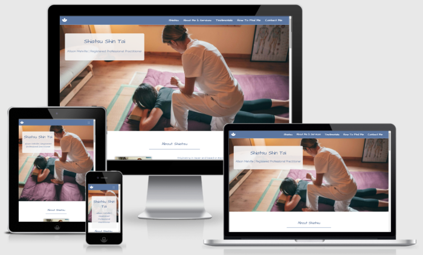

# Alison Melville's Shiatsu Massage

## About
**Alison Melville's Shiatsu** needs a B2C website that showcases a massage business specialising in Shin Tai near Manchester. I designed the site to educate the user about the benefits of Shiatsu Shin Tai and allow them to contact her to book a consultation. 
I created the site to look professional and in keeping with the theme of similar Shiatsu websites and using the colour schemes to bring a relaxing impression as would be expected with a massage site.
The goal of the website will be to interact with existing and potential clients and be a source of information to educate them, build confidence and encourage them to contact the business owner.
The site must contain all information required to complete these goals and site visitors will most likely be comparing with other similar services in the local area so must stand out and show everything the user would want to see.

Link to [live site](https://suzybee1987.github.io/ms1-ali-shiatsu/index.html)

## **Contents**

- [**UX (User Experience)**](#ux-user-experience)
  - [**User Stories**](#user-stories)
  - [**Project Goals**](#project-goals)
  - [**User Goals**](#user-goals)
  - [**Site Owner Goals**](#site-owner-goals)
- [**Design Choices**](#design-choices)
  - [**Fonts**](#fonts)
  - [**Colours**](#colours)
  - [**Imagery**](#imagery)
  - [**Wireframes**](#wireframes)
- [**Technologies**](#technologies)
  - [**Languages**](#languages)
  - [**Libraries**](#libraries)
  - [**Tools**](#tools)
- [**Features**](#features)
  - [**Features Implemented**](#features-implemented)
  - [**Future Features**](#future-features)
  - [**Responsive Design**](#responsive-design)
- [**Version Control**](#version-control)
- [**Testing**](#testing)
- [**Bugs**](#bugs)
- [**Deployment**](#deployment)
  - [**Running Locally**](#running-locally)
- [**Credits**](#credits)
  - [**Content**](#content)
  - [**Images**](#images)
  - [**Colour**](#colour)
  - [**Inspiration**](#inspiration)
  - [**Acknowledgements**](#acknowledgements)
  
 
## **UX (User Experience)**

### **User Stories**
- As a user visiting the site for the first time:
  - I want to be able to see social media links so that I can keep up to date through Facebook, Instagram and Twitter.
  - I want to click the navigation links to be taken to the correct section and also back to home for a better user experience.
  - I want the page to be in a predictable layout so that I can navigate it easily.  
  - I want to see a map of the location so that I can determine how close it is to my location and navigate there easily.  

- As a user returning to the site:
  - I want to be able to access the site easily on my chosen device
  - I want to easily be able to navigate to different parts of the site
  - I want to be able to contact the business owner as I wish through social media or contact form

- As a user who has never had a Shiatsu Shin Tai Massage before:
   - I want to use the site to learn more about Shiatsu Shin Tai and how to contact the business owner so that I can ask questions.
   - I want to see a demonstration of what to expect when receiving a Shiatsu Shin Tai massage.
   - I want some information about the price and time required per session
   - I want some information about the business owner's qualifications.
   
   
### **Project Goals**
- The primary goal of this site is to showcase Ali's Shiatsu Shin Tai massage business to attract new clients and provide a means of communication while linking to social media pages. 

### **User Goals**
- The user will be able to find out more about Shiatsu Shin Tai and be able to contact Ali for more information.

### **Site Owner Goals** 
- As a site owner I want the user to learn about Shiatsu Shin Tai massage and the business owner.
- As a site owner I want the user to be able to communicate with the business owner on social media and through contact form.
- As a site owner I want to show the user that the business owner is a registered practitioner of her work.
- As a site owner I want to create a website with a great user experience so that visitors will come again. 

[Back to contents](#contents)

## **Design Choices**

### **Fonts**

I have chosen [Architect's Daughter](https://fonts.google.com/specimen/Architects+Daughter) for the headers as it is easy to read and has sufficient contrast to the main body font. It is a cursive font so has a more easy-going, relaxed look inkeeping with the feel of the site. 
![assets/images/architects-daughter.png]

and [Montserrat](https://fonts.google.com/specimen/Montserrat) for the rest of the text on the site (eg. paragraphs and lists) as it is easy to read with wider spacing than other fonts.

![assets/images/montserrat.png]

### **Colours**

As the site purpose is about relaxation and massage the colour scheme used is adapted to suit with what the user would expect of this kind of site. It features complementary blue, green and purple colours that also stand out to make the content easy to read. The colours chosen are:

Format: [Coolors Palette](https://coolors.co/5b76a0-299491-45b0ae-827aa2-f5f9fd)

These colours compliment each other well and are not too striking, in keeping with what the user expects. 

### **Imagery**

Images can be found in [assets](assets/images) and feature Shin Tai massages being performed, a profile of the business owner and continue with the relaxing theme of the site.
Some of the images have been sourced from [Unsplash](https://unsplash.com/) and are free to use if credited and others were provided by the business owner. 
  
### Video

-index.html
  - The [Massage Demonstration Video](https://youtu.be/aLYgPbQXyGw) is performed by Saul Goodman who came up with the Shin Tai blend of massage. 

### **Wireframes**

The wireframes were created using [Balsamiq](https://balsamiq.com/) and can be found in pdf form in [wireframes](wireframes)

- [Home](wireframes/)
- [Contact Page](wireframes/contact.html)
- [Mobile View - Home](wireframes/mobile-index.html)
- [Mobile View - Contact Page](wireframes/mobile-contact.html)
- [Tablet View - Home](wireframes/tablet-index.html)
- [Tablet View - Contact Page](wireframes/tablet-contact.html)

[Back to contents](#contents)

## **Technologies**

### **Languages**

- [HTML5](https://developer.mozilla.org/en-US/docs/Web/HTML)
  - Used as the main markup language for the website content.
- [CSS3](https://developer.mozilla.org/en-US/docs/Web/CSS)
  - Used to style the individual webpages.
- [jQuery](https://developer.mozilla.org/en-US/docs/Glossary/jQuery) and [Popper.js](https://popper.js.org/)
  - Used with Bootstrap Scrollspy to track location on the page and Bootstrap Collapse for Accordian sections on mobile and tablet view. Also used with the contact form to launch the modal after required fields on form were completed. 

### **Libraries**
​
- [Bootstrap](https://getbootstrap.com/)
  - Used to design a mobile-first responsive website layout along with custom components (navigation bar toggle button, accordian, cards, scrollspy, footer).

  
### **Tools**

- [Git](https://git-scm.com/)
  - Git was used for version control (commit to Git and push to GitHub).
- [GitHub](https://github.com/)
  - Used to store, host and deploy the project files and source code after being pushed from Git. I also used it for the Project Kanban board.
- [Gitpod](https://www.gitpod.io/)
  - An online IDE linked to the GitHub repository used to write my code.
- [Font-Awesome](https://fontawesome.com/icons?d=gallery)
  - Used to make headings stand out and for favicon.
- [Google fonts](https://fonts.google.com/)
  - Used to compare and choose fonts. 
- [Coolors](https://coolors.co/)
  - Used to research and choose the colour scheme by comparing and contrasting similar colours in the generator.
- [Favicons](https://favicon.io/)
  - Used to generate a favicon for the website title.
- [Lighthouse](https://developers.google.com/web/tools/lighthouse)
  - Used to audit the site for quality and ensure responsiveness.
- [amiresponsive](http://ami.responsivedesign.is/)
  - An online tool to check how responsive the site is on different devices.

[Back to contents](#contents)

## **Features**

### **Features Implemented**

Features relevant to both pages:
- **Header**
  - Contains the navigation links and is fixed to the top of the page for easy use on all devices (this was done using Bootstrap sticky-top class).
  - All links are underlined when hovered over and for the icons this is done using the border-bottom attribute to provide spacing and prevent overlapping the icon.
  - The headings are underlined as the user visits different areas of the page (using Bootstrap scroll-spy) to help the user work out where they are in the page.
  - The home button is on the left of the header and sections of the page listed on the right where a user would expect them to be.
  - Navigation links are underlined when the user hovers over them to give feedback that they have hovered over the right spot.
  - On mobile and tablet view the Navigation links collapse in to a toggle button for easier user experience. Some JavaScript was used here to ensure the menu closes after a link is pressed to avoid the user having to close the menu. 
  - The colour scheme is designed to be easy to read with the contrast and the ratio tested on Google Dev Tools.

- **Hero sections**
  - The image takes up the full width of the browser to leave a high impact lasting impression with the user and this is replicated on both pages to bring a sense of familiarity when browsing.
  - The hero images were obtained when searching for massage related images to instantly give the user the confirmation that this is the site they were searching for.
  
 - **Footer** 
  - Designed to sit at the bottom of the page after all of the content 
  - Contains social media links and a link to Shiatsu Society website so that the user can verify the business owners professional status. 

  
*index.html*
  
- **About sections**
  - About Shiatsu and About Shin Tai sections contain some information which allows users to understand more about the subject, origin and health benefits.
  - About Me section gives the user some history about how the business owner discovered Shin Tai and confidence in her registered status along with a portrait of her for them to relate to.
  - On mobile and tablet view the About Shin Tai and About Me sections have been condensed using Bootstrap Accordian component to prevent the user from having to scroll through large volumes of text. The information is split in to subheadings to allow the user to target the information they require. 

- **Pricing and Services section**
  - Provides a video showing the massage being performed by the developer of Shin Tai to allow the user to understand what to expect.

- **Testimonials**
  - Bootstrap cards used here to contain the testimonial quotes - featured on browser are three cards but to save space on mobile and tablet this has been reduced to one. 

*contact.html*

- **Contact form**
  - For the user to contact the business owner, the fields: Name, Phone and Email and required and show error messages if not filled before clicking submit. Comments (textarea) is not required. 

- **Modal**
  - This component from Bootstrap's library is used to give feedback that the form has been submitted as without it the form would reset on submission. This required some use of JavaScript to show it only after all required fields have been filled. 

- **Buttons** 
  - On the form the buttons are as a user would expect there is a submit and reset button on the form with the Reset button having more muted colours and Submit button the obvious choice for the user to select upon submission. The modal Close button uses the same colour scheme making it easy for the user to understand what is expected after the message is displayed. 

### **Future Features**
- I would like to implement an appointment booking system and for the user to receive feedback of appointment booked via email and sms.
- I would also like to add an option for the user to add a testimonial to the business online and link to Trust Pilot

### **Responsive Design**

- Bootstrap columns were used to make the site responsive on all devices.

[Back to contents](#contents)

## **Version Control**

**Version control** was managed within **GitHub** and **Gitpod** and regular commits pushed to **GitHub**.

### Gitpod Workspaces
1. Starting from GitHub clone the [Code Institute template](https://github.com/Code-Institute-Org/gitpod-full-template) by clicking Use This Template and copying to my repository under the name ms1-ali-shiatsu. The workspace is then launched by clicking GitPod - this action only needs to be performed once and then workspace reopened from GitPod.
2. Start the Gitpod Workspace which opens an **online IDE editor** window.

### Update GitHub by committing from GitPod
3. After each change made I would save the code, perform *git add .*, *git commit -m "commit message here"* and *git push* to push my changes to the GitHub repository. 
4. Meaningful commit messages were used to allow to roll back any changes made throughout the journey.

After beginning this process I acknowledged that using git branches would be a more efficient way to do this to avoid any bugs in the future. 

[Back to contents](#contents)

## **Testing**

In this section, you need to convince the assessor that you have conducted enough testing to legitimately believe that the site works well. Essentially, in this part you will want to go over all of your user stories from the UX section and ensure that they all work as intended, with the project providing an easy and straightforward way for the users to achieve their goals.

Whenever it is feasible, prefer to automate your tests, and if you've done so, provide a brief explanation of your approach, link to the test file(s) and explain how to run them.

For any scenarios that have not been automated, test the user stories manually and provide as much detail as is relevant. A particularly useful form for describing your testing process is via scenarios, such as:

1. Contact form:
    1. Go to the "Contact Us" page
    2. Try to submit the empty form and verify that an error message about the required fields appears
    3. Try to submit the form with an invalid email address and verify that a relevant error message appears
    4. Try to submit the form with all inputs valid and verify that a success message appears.

In addition, you should mention in this section how your project looks and works on different browsers and screen sizes.

[Back to contents](#contents)

## **Bugs**

You should also mention in this section any interesting bugs or problems you discovered during your testing, even if you haven't addressed them yet.

If this section grows too long, you may want to split it off into a separate file and link to it from here.

[Back to contents](#contents)

## **Deployment**

The project was developed using [GitPod](https://gitpod.io/) and pushed to [GitHub](https://github.com/) as follows:

To deploy the page to **GitHub Pages** these steps were taken:
1. Log in to **GitHub**.
2. Select **suzybee1987/ms1-ali-shiatsu**.
3. Click Settings and scroll down to **Pages**.
4. Under **Source** select **None** and then **Master Branch**.
5. The site automatically refreshes and the website deployed providing the link: https://suzybee1987.github.io/ms1-ali-shiatsu/index.html

### How to run the project locally

To clone this project from GitHub follow the instructions taken from [GitHub Docs](https://docs.github.com/en/github/creating-cloning-and-archiving-repositories/cloning-a-repository):
1. Navigate to the [GitHub Repository](https://github.com/suzybee1987/ms1-ali-shiatsu)
2. Above the files click the green Download Code link.
3. To clone using HTTPS click the clipboard symbol under "Clone with HTTPS". To clone using SSH key click Use SSH then click the clipboard symbol. To clone using GitHub CLI select Use GitHub CLI and click the clipboard symbol. 
4. Open Git Bash
5. Change the working directory to the location you want the cloned directory to be.
6. Type 'git clone' and paste the url copied from step 3. 
7. Press 'enter' to create your clone.

[Back to contents](#contents)

## **Credits**

### **Content**
- The information provided regarding Shiatsu was provided by the business owner, Alison Melville. 

### **Images**

- #index.html
  - The [Hero image](assets/images/conscious-design-J16LdoIsRJM-unsplash.jpg) on index.html was sourced from [Unsplash](https://unsplash.com/). Photo by <a href="https://unsplash.com/@conscious_design?utm_source=unsplash&utm_medium=referral&utm_content=creditCopyText">Conscious Design</a> on <a href="https://unsplash.com/s/photos/massage-therapy?utm_source=unsplash&utm_medium=referral&utm_content=creditCopyText">Unsplash</a>
  - The images of [Alison Performing Shin Tai Massage](assets/images/Ali-massage2.jpg) and [Alison's profile photo](assets/images/ali-photo2.jpg) were taken by her husband, Iain Melville.

- #contact.html
The hero image on contact.html was sourced from [Unsplash](https://unsplash.com/). Photo by <a href="https://unsplash.com/@lgence?utm_source=unsplash&utm_medium=referral&utm_content=creditCopyText">Laurent Gence</a> on <a href="https://unsplash.com/@dfu05229/likes?utm_source=unsplash&utm_medium=referral&utm_content=creditCopyText">Unsplash</a>
  
### **Inspiration**

- Scrollspy navigation inspiration from Peer Code Review project posted by [Claire Lemonair](https://github.com/lemocla/MS1-Catsitting#acknowlegements), (https://lemocla.github.io/MS1-Catsitting/)

### **Acknowledgements**

- I received inspiration for this project from X

[Back to contents](#contents)
